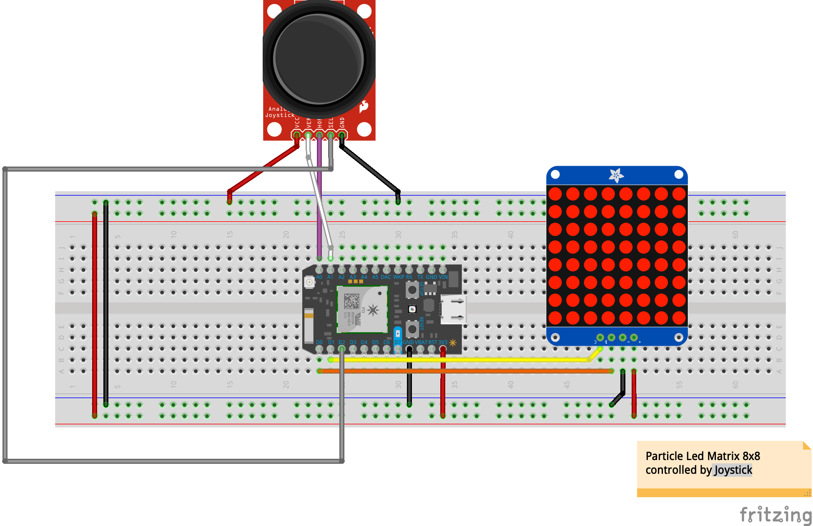

# Dot Matrix Joystick

>A minimalist game using [Particle Photon](https://docs.particle.io/photon/) that controls a LED Matrix 8x8 with a Joystick

## Libraries
This projects uses several libraries:
- [Adafruit_LEDBackpack_RK](https://github.com/rickkas7/Adafruit_LED_Backpack_RK) driver to control the i2c interface with the Led Matrix.
- [Adafruit_GFX_RK](https://github.com/rickkas7/Adafruit_GFX_RK) Core graphics library for Adafruits products.

## The Circuit:


You can also open the Frizting file [here](dot-matrix-joystick.fzz)

  * Joystick Module and Led Matrix Vcc Pins to Photon's 3.3V Vcc output
  * Joystick Module and Led Matrix GND Pins to Photon's GND output
  * Joystick Module X (Horizontal) pin connected to Photon's A0, Y (Vertical) to A1 and Z (Select) connected to D3
  * Led Matrix SCL pin connected to Photon's D1, SDA pin connected to D2


## Development

### Install dependencies (libraries)

For installing the dependencies on [project.properties](project.properties). More info in the section of ```project.properties``` below.

`particle library install --vendored`

This will create a `/lib` folder for you.

Every new Particle project is composed of 3 important elements that you'll see have been created in your project directory for dth11-sensor.

#### ```/src``` folder:
This is the source folder that contains the firmware files for your project. It should *not* be renamed.
Anything that is in this folder when you compile your project will be sent to our compile service and compiled into a firmware binary for the Particle device that you have targeted.

If your application contains multiple files, they should all be included in the `src` folder. If your firmware depends on Particle libraries, those dependencies are specified in the `project.properties` file referenced below.

#### ```.ino``` file:
This file is the firmware that will run as the primary application on your Particle device. It contains a `setup()` and `loop()` function, and can be written in Wiring or C/C++. For more information about using the Particle firmware API to create firmware for your Particle device, refer to the [Firmware Reference](https://docs.particle.io/reference/firmware/) section of the Particle documentation.

#### ```project.properties``` file:
This is the file that specifies the name and version number of the libraries that your project depends on. Dependencies are added automatically to your `project.properties` file when you add a library to a project using the `particle library add` command in the CLI or add a library in the Desktop IDE.

## Adding additional files to your project

#### Projects with multiple sources
If you would like add additional files to your application, they should be added to the `/src` folder. All files in the `/src` folder will be sent to the Particle Cloud to produce a compiled binary.

#### Projects with external libraries
If your project includes a library that has not been registered in the Particle libraries system, you should create a new folder named `/lib/<libraryname>/src` under `/<project dir>` and add the `.h`, `.cpp` & `library.properties` files for your library there. Read the [Firmware Libraries guide](https://docs.particle.io/guide/tools-and-features/libraries/) for more details on how to develop libraries. Note that all contents of the `/lib` folder and subfolders will also be sent to the Cloud for compilation.

## Compiling your project

When you're ready to compile your project, make sure you have the correct Particle device target selected and run `particle compile <platform>` in the CLI or click the Compile button in the Desktop IDE. The following files in your project folder will be sent to the compile service:

- Everything in the `/src` folder, including your `.ino` application file
- The `project.properties` file for your project
- Any libraries stored under `lib/<libraryname>/src`

  # Support, Questions, or Feedback
> Contact me anytime for anything about this repo or IoT in general

* [Email: Alvaro Saburido](alvaro.saburido@gmail.com)
* [Twitter: @alvarosaburido1](https://twitter.com/alvarosaburido1)

___

# License
 [MIT](/LICENSE)
